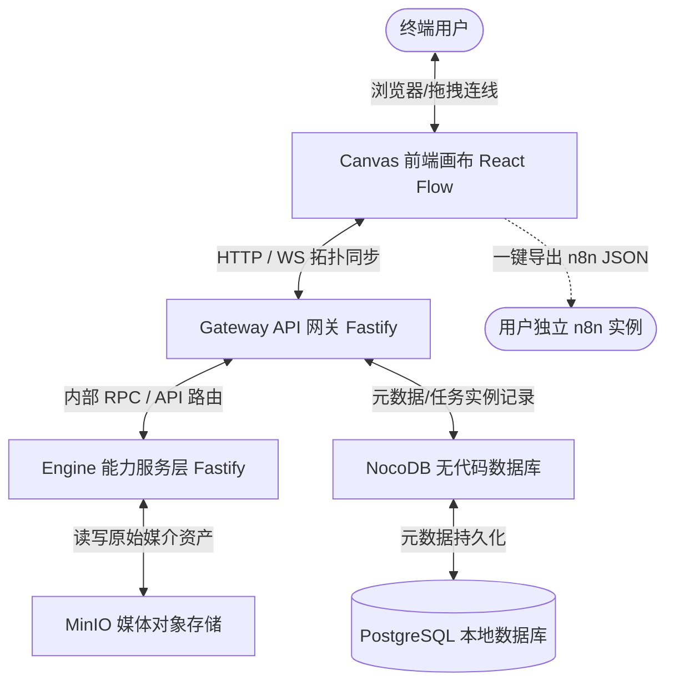

# AI Workflow Orchestration Engine (AI 工作流编排引擎) 架构白皮书 (arc42)

本架构白皮书基于国际标准的 **arc42** 架构文档模板编写，旨在对“AI 工作流编排引擎”进行全面、严密的系统架构设计，锁定前后端数据协议、存储规范以及生态转译契约。

---

## 1. 简介与目标 (Introduction and Goals)

### 1.1 核心定位
本系统定位为 **可视化节点拖拽画布 + Agent 协同调度 + Skill 插件体系的 AI 应用母工具（三明治架构体系）**。支持用户在前端画布上通过拖拽 LLM、生图、视频、配音、条件等节点构建复杂的 AI 自动化工作流，同时支持将工作流单向转译并导出为符合外部生态（如 n8n）规范的标准工作流 JSON 文件。

### 1.2 质量目标 (Quality Goals)
1. **模块解耦性**：前端画布层、网关层、能力服务层三者物理分离，通过标准 RESTful / WebSocket API 交互。
2. **格式保真度 (Fidelity)**：导出的 n8n 工作流 JSON 必须符合 n8n 官方规范，保证 100% 导入即用，无任何格式破坏。
3. **数据一致性**：多媒体资产（图片、视频、音频）在 MinIO 上的存储路径必须具备强命名空间规范，防止悬空资源与越权访问。

---

## 2. 约束条件 (Constraints)

- **开发环境限制**：基于 Windows 本地环境进行敏捷开发。
- **依赖服务隔离**：MinIO、NocoDB 等基础设施必须通过本地 Docker Compose 容器化拉起，禁止污染宿主机。
- **无损回退与 Git 管理**：各个子模块（canvas、gateway、engine）均需支持独立的版本管理，目录结构需清晰严密。

---

## 3. 系统上下文与范围 (System Context and Scope)



- **Canvas (前端画布)**：独立的单页应用 (SPA)，负责渲染微光磨砂玻璃风 UI，管理节点与连线状态，并实现 `n8nTranspiler` 导出模块。
- **Gateway (API 网关)**：系统的交通枢纽，负责对画布上送的拓扑图进行 DAG 校验（有向无环图环路检测）、路由分发，并维护任务运行实例状态。
- **Engine (能力服务)**：真正的 AI 执行体，对接 LLM（剧本）、ComfyUI/RunningHub（视频/生图）、Fish.audio/TTS 等外部 AI 能力，并与 MinIO 深度交互。
- **MinIO & NocoDB**：本地 Docker 化的基础设施，分别锁死多媒体资产和流数据。

---

## 4. 架构策略 (Solution Strategy)

1. **前后端解耦的 DAG 数据契约**：前端 React Flow 不感知后端的运行细节，只提交完整的 Canvas Graph JSON。网关层负责利用 Kahn 算法进行拓扑排序，并在生成拓扑序列后，按序或并行分发至 Engine。
2. **工作流转译模式 (Transpiler Pattern)**：在前端（或网关层）定义统一的 `WorkflowTranspiler` 接口。对于 n8n 导出，设计 `n8nTranspiler` 适配器，将画布中的 `LLM Node`、`Video Node` 等高级抽象节点，转换为 n8n 原生的 `AI Agent Node` 加上与之配套的 `HTTP Request Tool Node` 组合。
3. **本地开发一键拉起**：提供 `docker-compose.yml`，集成 MinIO + NocoDB + PostgreSQL，实现本地无痛一键拉起。

---

## 5. 建筑物视图 (Building Block View)

### 5.1 核心数据结构定义 (Data Contract)
为了在前后端和转译层中将契约“死锁”，我们定义如下统一 JSON 模型：

#### 5.1.1 Canvas Graph JSON (画布原生拓扑格式)
```json
{
  "projectId": "proj_001",
  "version": "1.0.0",
  "nodes": [
    {
      "id": "node_llm_001",
      "type": "llm",
      "position": { "x": 100, "y": 150 },
      "data": {
        "title": "剧本生成专家",
        "promptTemplate": "请写一个关于 {topic} 的科幻短剧",
        "variables": ["topic"],
        "model": "gpt-4o"
      }
    },
    {
      "id": "node_tts_001",
      "type": "tts",
      "position": { "x": 400, "y": 150 },
      "data": {
        "title": "AI 声音合成",
        "voiceId": "character_default_male",
        "speed": 1.0
      }
    }
  ],
  "edges": [
    {
      "id": "edge_001",
      "source": "node_llm_001",
      "target": "node_tts_001",
      "sourceHandle": "output_text",
      "targetHandle": "input_text"
    }
  ]
}
```

---

## 6. 部署视图 (Deployment View) - 方案 A (基础设施容器化)

为了彻底避免本地开发环境与 Windows 宿主机常见服务的端口冲突（如本地已有的 PostgreSQL 5432 端口或 IIS/Apache 8080 端口），我们特将所有外层映射端口调整为**高位不常用端口**。

### 6.1 锁死的本地端口映射列表
*   **PostgreSQL 数据库**：内部 `5432` -> 本地暴露 `15432`
*   **NocoDB 控制台**：内部 `8080` -> 本地暴露 `18080`
*   **MinIO API 端口**：内部 `9000` -> 本地暴露 `19000`
*   **MinIO Web 控制台**：内部 `9001` -> 本地暴露 `19001`

### 6.2 `docker-compose.yml` 物理配置契约
```yaml
version: '3.8'

services:
  # PostgreSQL: NocoDB 的持久化底座
  db_postgres:
    image: postgres:15-alpine
    container_name: workflow_postgres
    environment:
      POSTGRES_USER: admin
      POSTGRES_PASSWORD: SecretPassword123
      POSTGRES_DB: nocodb_meta
    volumes:
      - postgres_data:/var/lib/postgresql/data
    ports:
      - "15432:5432"
    networks:
      - workflow_network

  # NocoDB: 无代码数据库管理后台
  nocodb:
    image: nocodb/nocodb:latest
    container_name: workflow_nocodb
    environment:
      NC_DB: "pg://db_postgres:5432?u=admin&p=SecretPassword123&d=nocodb_meta"
    ports:
      - "18080:8080"
    depends_on:
      - db_postgres
    networks:
      - workflow_network

  # MinIO: 本地媒体对象存储
  minio:
    image: minio/minio:latest
    container_name: workflow_minio
    command: server /data --console-address ":9001"
    ports:
      - "19000:9000"  # API 端口
      - "19001:9001"  # 控制台端口
    environment:
      MINIO_ROOT_USER: minio_admin
      MINIO_ROOT_PASSWORD: MinioSecretPassword123
    volumes:
      - minio_data:/data
    networks:
      - workflow_network

volumes:
  postgres_data:
  minio_data:

networks:
  workflow_network:
    driver: bridge
```

---

## 7. 横切概念 (Cross-cutting Concepts)

### 7.1 MinIO 存储桶命名与目录分级规范
为了防止多媒体资产的混乱覆盖，所有文件上传必须严格遵循以下目录命名空间模式：

`桶名称 (Bucket Name): ai-workflow-assets`

#### 目录树结构：
```text
ai-workflow-assets/
└── projects/
    └── {project_id}/               # 项目级别物理隔离
        ├── scripts/
        │   └── script_{version}.json # 剧本的多版本 JSON
        ├── storyboard/
        │   ├── slice_001.png       # 宫格切割后的单帧图片
        │   └── slice_002.png
        ├── audio/
        │   └── voice_001.wav       # TTS 合成的配音资产
        └── video/
            └── final_composite.mp4 # 最终渲染合成的视频
```

### 7.2 n8n 工作流转译映射契约 (`WorkflowTranspiler`)
`WorkflowTranspiler` 将我们的 Canvas Graph DAG 转换为符合 n8n 结构的格式。

#### 7.2.1 n8n 节点输出 JSON 的标准框架
```json
{
  "name": "Exported AI Workflow",
  "nodes": [
    {
      "parameters": {
        "options": {}
      },
      "id": "c1f7a2b9-3e4b-4f9e-8c5d-2b3a4f5e6d7c",
      "name": "When Webhook Triggered",
      "type": "n8n-nodes-base.webhook",
      "typeVersion": 1,
      "position": [250, 300]
    },
    {
      "parameters": {
        "model": "gpt-4o",
        "options": {}
      },
      "id": "e2a3b4c5-5d6e-7f8a-9b0c-1d2e3f4a5b6c",
      "name": "OpenAI Chat Model",
      "type": "@n8n/n8n-nodes-langchain.lmChatOpenAi",
      "typeVersion": 1,
      "position": [400, 450]
    }
  ],
  "connections": {
    "When Webhook Triggered": {
      "main": [
        [
          {
            "node": "OpenAI Chat Model",
            "type": "main",
            "index": 0
          }
        ]
      ]
    }
  },
  "active": false,
  "settings": {
    "executionOrder": "v1"
  }
}
```

---

## 8. AI 接入层：RunningHub 云端 ComfyUI 驱动机制设计

根据 `E:\二开Toonflow-app` 项目中已解耦的 `runninghub.ts` 适配器模型，我们的 **Engine 能力服务层** 将通过“云端 ComfyUI 工作流参数注入”模式，调度视频和配音节点。

### 8.1 统一 API 交互时序 (RunningHub Client Pipeline)
对云端任何 ComfyUI 节点的调度，均需严格执行以下四大步骤：

```
[Our Engine]             [RunningHub OpenAPI]
     │                           │
     │ 1. 上传参考媒体 (若有)     │
     ├──────────────────────────>│ POST /openapi/v2/media/upload/binary
     │ <─────────────────────────┤ 返回云端临时文件名 (fileName)
     │                           │
     │ 2. 注入参数并启动工作流    │
     ├──────────────────────────>│ POST /task/openapi/create
     │                           │ (带上 workflowId, apiKey, 以及 nodeInfoList)
     │ <─────────────────────────┤ 返回任务标识 (taskId)
     │                           │
     │ 3. 轮询任务执行状态        │
     ├──────────────────────────>│ POST /task/openapi/status
     │ <─────────────────────────┤ 返回 SUCCESS / FAILED / RUNNING
     │                           │
     │ 4. 任务成功，拉取输出结果  │
     ├──────────────────────────>│ POST /task/openapi/outputs
     │ <─────────────────────────┤ 返回最终文件 URL (fileUrl)
     ▼                           ▼
```

### 8.2 TTS 节点（声音克隆与配音）核心调用规范
在 `Engine` 层的配音服务中，通过向 RunningHub 上挂载的声音克隆 ComfyUI 工作流注入参数实现：
*   **云端工作流 ID**: `2029428174693601281`（或其他配置中指定的 TTS 工作流）
*   **参数注入节点规范 (`nodeInfoList`)**:
    *   **台词文本 (lineText)**：绑定目标 Node（如 `nodeId: 332`，`fieldName: "text"`）。
    *   **音色稳定种子 (calculatedSeed)**：绑定 Node（如 `nodeId: 79`，`fieldName: "seed"`），在执行前根据剧本角色名称（`roleName`）进行 Hash 运算生成一个固定的种子值，确保同一个角色的配音音色高度一致。
    *   **参考音频映射 (refAudioMapping)**：若启用声音克隆，系统首先将用户上传或预置的参考音频通过 `upload/binary` 上传云端，然后将返回的 `fileName` 绑定到 ComfyUI 中对应的 LoadAudio 节点（如 `nodeId: [20, 331]`，`fieldName: "audio"`）。同时将参考人名绑定到文本节点（如 `nodeId: 24`，`fieldName: "name"`）。

### 8.3 Video 节点（视频融合与视频生成）核心调用规范
对于复杂的视频融合任务（如 LTX2.3 高级视频工作流）：
*   **云端工作流 ID**: `2047974142976204801`（或自定义 LTX 工作流）
*   **参数注入节点规范 (`nodeInfoList`)**:
    *   **提示词 (Prompt)**：绑定 ComfyUI 的提示词输入框（如 `nodeId: 303`，`fieldName: "value"`）。
    *   **参考图 (Image)**：将前端画布传递的上一级生图节点的输出（已保存在 MinIO 中并通过 API 上传云端），注入到 ComfyUI 的 LoadImage 节点（如 `nodeId: 269`，`fieldName: "image"`）。
    *   **参考音频 (Audio)**：若该视频需要直接融合配音，通过 MIME-Type 自动识别参考音频并将其注入到 ComfyUI 的 LoadAudio 节点（如 `nodeId: 447`，`fieldName: "audio"`）。
    *   **分辨率与时长参数**：
        *   宽度 (Width)：绑定 Node `314` (fieldName: `value`)，根据前端画幅比例（如 16:9 映射为 1024）。
        *   高度 (Height)：绑定 Node `299` (fieldName: `value`)，映射为 576。
        *   时长 (Duration)：绑定 Node `427` (fieldName: `value`)，强制单位为秒。

---

## 9. 架构决策 (Architecture Decisions - ADR)

### ADR-001: 强类型端点限制
- **决策**：在 React Flow 的自定义 Node 中启用 `isValidConnection`。
- **理由**：防止在前端错连不兼容的插槽（如将 `Image` 输出错误地连入 `Audio` 输入），从而把拓扑错误在画布端拦截，提升用户体验。

### ADR-002: 异步任务处理与轮询
- **决策**：Gateway 层使用 WebSocket 主动推送任务状态，配合 HTTP GET `/api/v1/jobs/{job_id}/status` 进行容错轮询。
- **理由**：由于 ComfyUI 视频合成、LLM 长文本生成属于重型异步长任务，传统的 HTTP 阻塞连接极易超时。

